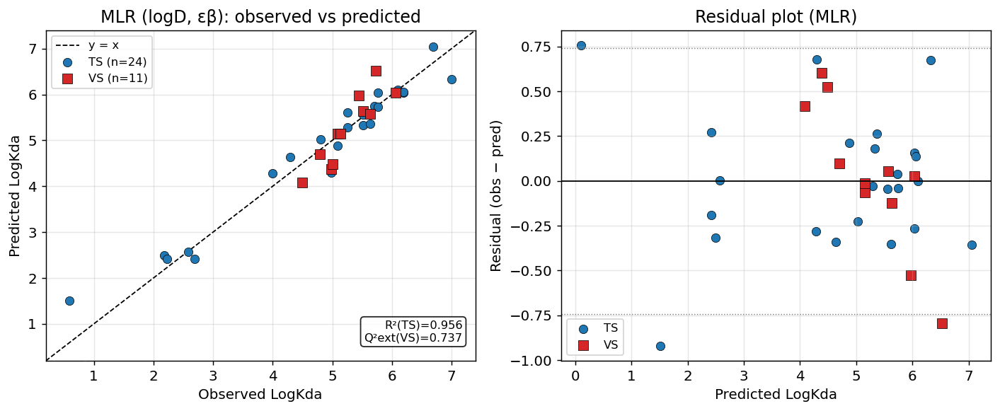
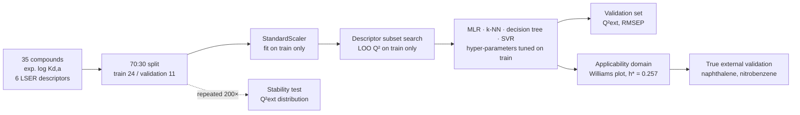
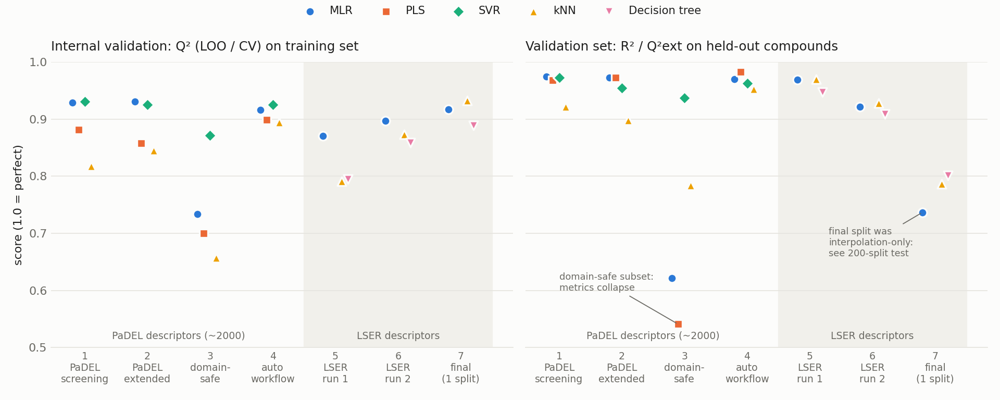

# QSPR model of organic pollutant sorption on polypropylene microplastics

[](https://github.com/setsun-ai/qspr-microplastic-sorption/actions/workflows/ci.yml)

**MSc coursework.** An interpretable two-descriptor model that predicts how strongly organic pollutants sorb to polypropylene microplastics in seawater (log K<sub>d,a</sub>).

This README covers the final model and the 7-stage path that led to it. The path includes:
- the high-scoring models that were rejected,
- the validation test that decided between models,
- one command (`python run_analysis.py`) that reproduces the final numbers from the data.



## Context & motivation

Microplastics carry hydrophobic pollutants (PAHs, PCBs, pharmaceuticals) through the marine environment. How much they carry depends on the partition coefficient between the polymer and water. Measuring it for thousands of chemicals is impractical, so QSPR models that predict it from molecular structure are a standard screening tool, used the same way as property prediction in early drug discovery.

The project practised the full QSPR workflow:
- describing structures with molecular descriptors,
- building models with several machine-learning methods,
- validating them along OECD principles (defined endpoint, unambiguous algorithm, applicability domain, internal and external validation, mechanistic interpretation).

The main lesson is that with **n = 35 compounds**, the best-looking model is often not the best model. Abstract descriptors picked from about 2 000 candidates gave Q² ≈ 0.93 but failed on new compounds. A two-descriptor model with a clear physical meaning was the most stable.

## Final model

log K<sub>d,a</sub> = 6.735 + 0.751·log D − 19.32·ε<sub>β</sub>

| n | R² | Q²<sub>LOO</sub> | Q²<sub>ext</sub>, 200 random 70:30 splits | max VIF |
|---|---|---|---|---|
| 35 | 0.939 | 0.913 | **0.906 ± 0.040** (min 0.74; reproduced, see below) | 1.03 |

- **log D (lipophilicity):** a positive coefficient. More hydrophobic compounds sorb more strongly to non-polar PP.
- **ε<sub>β</sub> (hydrogen-bond basicity):** a negative coefficient. H-bond acceptors stay in the water phase.
- Both signs are mechanistically correct. Comparing standardised coefficients, log D is about 2.3× the stronger factor.

## Pipeline



| Dataset | Preprocessing | Feature selection | Model | Validation |
|---|---|---|---|---|
| 35 organic compounds, log K<sub>d,a</sub> 0.59–7.0; 6 LSER descriptors (log D, M′<sub>w</sub>, ε<sub>α</sub>, ε<sub>β</sub>, V′, π) | standardisation fitted on the training set; ε<sub>α</sub> excluded as spurious (see below) | a priori {log D, ε<sub>β</sub>} from mechanism and collinearity; an exhaustive subset search on the training set picks the same pair | MLR (final); k-NN, decision tree, RBF-SVR, MLR + π as comparators | LOO on the training set; 70:30 hold-out; 200 random splits; Williams-plot applicability domain; two external compounds |

## Reproducibility

```bash
pip install -r requirements.txt
python run_analysis.py              # ~30 s; writes results/final_reproduction/
python run_analysis.py --quick      # 20 stability splits (smoke run, used in CI)
pytest                              # leakage, split-integrity and regression tests
```

The original stage-7 script was not preserved, so `run_analysis.py` is a reconstruction from the final report. Its output is compared with the reported numbers in [`results/final_reproduction/reported_vs_reproduced.csv`](results/final_reproduction/reported_vs_reproduced.csv):

| Quantity | Report | Reproduced | Note |
|---|---|---|---|
| Final MLR: R² / Q²<sub>LOO</sub> | 0.939 / 0.913 | 0.939 / 0.913 | exact |
| Main split, MLR: R²<sub>TS</sub> / Q²<sub>CV</sub> / Q²<sub>ext</sub> / RMSEP | 0.956 / 0.917 / 0.737 / 0.398 | same | exact |
| Main split, MLR + π / decision tree: Q²<sub>ext</sub> | 0.748 / 0.801 | 0.748 / 0.801 | exact |
| Main split, k-NN (k = 1): Q²<sub>ext</sub> | 0.787 | **0.698** | not reproducible. 0.787 equals the LOO Q² for k = 3 in the same report, most likely a transcription error |
| 200 splits: MLR / k-NN (k = 3) / tree | 0.909 ± 0.035 / 0.730 ± 0.147 / 0.797 ± 0.213 | 0.906 ± 0.040 / 0.729 ± 0.162 / 0.795 ± 0.195 | the original split seeds are unknown; here seeds 0–199. Same ranking and conclusion |
| Naphthalene / nitrobenzene | ≈ 3.50 / ≈ 1.81 | 3.495 / 1.807 | exact |

The reconstruction also adds an RBF-SVR, tuned by 5-fold CV inside each training set. It wins on the single main split (Q²<sub>ext</sub> 0.831) but is less stable over 200 splits (0.890 ± 0.172, min −0.22). That supports the choice of MLR.

## Validation & limitations

- **Chance correlation at n = 35.** With about 2 000 candidate descriptors and 35 compounds, an exhaustive subset search will find combinations that fit well by chance. That is why the stage 1–4 models (Q²<sub>LOO</sub> ≈ 0.93 with abstract descriptors such as Mi, THSA, RDF30i) were not accepted, even though they scored highest on paper.
- **Single splits mislead.** The main 70:30 split contains only interpolation cases (validation log K<sub>d,a</sub> 4.5–6.1), so all models look similar on it. The 200-split distribution is what separates them.
- **Data gap.** The training data have two clusters: 2 pharmaceuticals with log D < 1 and 33 hydrophobic compounds with log D 4.3–8.3. Nitrobenzene (log D 1.85) is formally inside the applicability domain (h = 0.153 < h* = 0.257) but sits in the empty gap, so its prediction (1.81) is uncertain and probably underestimated.
- **Scope.** The model covers PP in seawater only. Other polymers (PE, PS) would need separate data.

## What failed / what I changed



| # | Stage | Descriptors | Algorithms | Best result | What it taught me |
|---|---|---|---|---|---|
| 1 | [PaDEL screening](stages/1_padel_descriptor_screening) | ~2000 PaDEL → exhaustive search over 2–4 descriptor subsets | MLR, PLS, SVR, k-NN | MLR {Mi, THSA, MLFER_L}: Q²<sub>LOO</sub> 0.929, R²<sub>VS</sub> 0.975 | Very high scores, but abstract descriptors picked from ~2000 candidates for 35 compounds carry a real risk of chance correlation |
| 2 | [Extended PaDEL pipeline](stages/2_padel_extended_pipeline) | variance and correlation filters, all-subsets, PLS-VIP, SVR-RFE, GA-SVR | MLR, PLS, SVR, k-NN | MLR {CrippenLogP, SHBa, ALogP, RDF30i}: Q²<sub>LOO</sub> 0.931, R²<sub>VS</sub> 0.973 | Lipophilicity descriptors (CrippenLogP, ALogP, XLogP) dominate every model; PLS VIP confirms it |
| 3 | [Domain-safe descriptors](stages/3_domain_safe_descriptors) | only descriptors also valid for the external compounds (XLogP, TopoPSA, nAromBond) | MLR, PLS, SVR, k-NN | SVR: Q²<sub>LOO</sub> 0.872, R²<sub>VS</sub> 0.937; MLR fell to R²<sub>VS</sub> 0.62 | Once descriptors must also cover new compounds, much of the stage 1–2 performance disappears |
| 4 | [Automated workflow + external check](stages/4_auto_workflow_external_validation) | automated pruning of collinear descriptors, ranking by a combined score, applicability domain | MLR, PLS, SVR, k-NN | SVR {RDF135e, CrippenLogP, SHBa}: best overall score, 0 VS compounds outside the AD | Naphthalene predicted reasonably, but **nitrobenzene failed for every model** (errors 1.0–2.9 log units, outside the AD) |
| 5 | [LSER run 1](stages/5_lser_run1) | switched to 6 mechanistic LSER descriptors, scaled on the training set only | MLR, k-NN, decision tree | MLR {log D, ε<sub>β</sub>, π}: Q²<sub>CV</sub> 0.871, R²<sub>VS</sub> 0.969 | Comparable accuracy with 3 interpretable descriptors instead of 4 abstract ones. k-NN with k = 1 reached R²<sub>TS</sub> = 1.0, i.e. memorisation |
| 6 | [LSER run 2 + reference check](stages/6_lser_run2_reference_check) | MLR-2 {log D, ε<sub>β</sub>} vs MLR-4 (+ ε<sub>α</sub>, V′) | MLR, k-NN, decision tree | MLR-2: Q²<sub>CV</sub> 0.897, R²<sub>VS</sub> 0.922 | MLR-4 matched the literature values best, but its nitrobenzene prediction was outside the AD. A good match outside the domain is not validation |
| 7 | [Final model](final/) + [`run_analysis.py`](run_analysis.py) | {log D, ε<sub>β</sub>}, chosen a priori from mechanism and collinearity | MLR, k-NN, decision tree, SVR (+ PLS, SVM cross-check in [Orange](orange/)) | MLR: stable Q²<sub>ext</sub> over 200 splits | A single train/test split was misleading. The 200-split stability test decided the final model |

**Problems found and fixed along the way:**
- **Corrupted external rows.** The descriptor rows for naphthalene and nitrobenzene in the course Excel file had ε<sub>α</sub> = 0 and wrong molar masses. The corrected descriptors from the task sheet are used instead ([`data/external_lser.csv`](data/external_lser.csv)).
- **Spurious ε<sub>α</sub>.** Its correlation with log K<sub>d,a</sub> came entirely from two high-leverage pharmaceuticals. Within the 33 hydrophobic compounds it dropped to r = −0.15, so it was excluded.
- **Leakage control.** Scaling, descriptor selection and hyper-parameter tuning see only training rows. External reference values were never used for model choice. `tests/test_pipeline.py` checks this by corrupting the validation targets and asserting that nothing on the training side changes.

### Algorithm comparison

| Algorithm | Strengths seen in this project | Weaknesses seen in this project |
|---|---|---|
| **MLR** | Explicit equation with interpretable signs. Most stable across 200 random splits. Smallest gap between fit and prediction (R² 0.939 vs Q² 0.913). Can extrapolate linearly. | Sensitive to collinearity (needs VIF control). With thousands of candidate descriptors, subset search easily finds chance correlations (stage 1). |
| **PLS** | Handles many correlated descriptors without explicit selection; VIP ranks descriptor importance. Highest single-split R²<sub>VS</sub> (0.983, stage 4). | Many-descriptor models (15–19 variables) are hard to interpret. Least robust once restricted to domain-safe descriptors (R²<sub>VS</sub> 0.54). Worst external prediction (nitrobenzene error 2.9). |
| **SVR (RBF)** | Most robust in the PaDEL stages, including the domain-safe set (R²<sub>VS</sub> 0.94). Best single split in the reconstruction (Q²<sub>ext</sub> 0.83). | Black box. Needs a grid search over C, ε and γ. Over 200 splits less stable than MLR (min −0.22). |
| **k-NN** | Simple and non-parametric. Confirms log D as the key neighbour metric. | LOO Q² falls steadily as k grows (0.93 → 0.33 for k = 1 → 10), a sign of memorisation. Cannot extrapolate beyond the training range. Wide spread across splits (0.73 ± 0.16). |
| **Decision tree** | Shows the log D dominance directly (feature importance 0.97). | Step-wise predictions. Least stable model (min −0.44 over 200 splits). Threshold artefact for naphthalene (predicted 0.72 vs reference 3.7). |

### External compounds across stages

| Stage / model | Naphthalene | Nitrobenzene | Comment |
|---|---|---|---|
| 3: SVR (domain-safe) | 5.19 | 2.00 | Overestimates naphthalene |
| 4: MLR (PaDEL) | 3.72 | 1.29 | Nitrobenzene is a residual outlier |
| 4: PLS (PaDEL) | 3.90 | 0.28 | Nitrobenzene outside the AD |
| 6: MLR-4 (LSER) | 3.76 | 2.31 | Closest values, but nitrobenzene is outside the AD |
| 6: decision tree | 0.72 | 2.44 | Threshold artefact |
| **7: final MLR** | **3.50** (h = 0.083) | **1.81** (h = 0.153, data gap) | Inside the AD by leverage; nitrobenzene still uncertain |

Reference values: naphthalene ≈ 3.7–4.1 and nitrobenzene ≈ 2.5–3.2, depending on the source. They were used **only after** the models were built.

## Repository structure

```
run_analysis.py        reproducible final analysis (one command)
tests/                 pytest: leakage, split integrity, regression values, smoke run
results/final_reproduction/   outputs of run_analysis.py
final/                 final report, presentations (PDF + PPTX, in Polish), figures
stages/1…6/            every earlier iteration: scripts, outputs, reports (archived as they were)
orange/                Orange Data Mining workflow (Linear Regression, kNN, PLS, SVM)
data/                  modelling dataset, external-set descriptors
descriptors/           PaDEL 2D/3D descriptors for 5 compounds and the external set
quantum_chemistry/     MOPAC PM6 optimisation (gas phase and COSMO, ε = 78.4) for 5 compounds
docs/                  development-journey chart
```

The archived scripts in `stages/` were run with older library versions and are kept as a record. Only `run_analysis.py` is tested in CI.

## Data

- **Experimental log K<sub>d,a</sub> (PP–seawater) and the 6 LSER descriptors** for the 35 compounds follow Li Y. et al. (2020), *QSPR models for predicting the adsorption capacity for microplastics of polyethylene, polypropylene and polystyrene*, **Scientific Reports 10:14597**, [doi:10.1038/s41598-020-71390-3](https://doi.org/10.1038/s41598-020-71390-3) (CC BY 4.0). The course compiled them, together with ~1 990 PaDEL/Dragon-type descriptors, into `data/data_qsar_pls.xlsx`.
- **External compounds:** LSER descriptors from the course task sheet ([`data/external_lser.csv`](data/external_lser.csv)). Literature sorption values are cited in the final report (e.g. Lee et al. 2014; Hüffer & Hofmann 2016).
- **My own calculations:** PaDEL 2D/3D descriptors for 5 compounds and the external set, plus MOPAC PM6 geometries.

No personal or sensitive data are involved.

## Scope

- **Set by the course:** the endpoint and dataset (35 compounds, PP–seawater), a TS/VS split, at least three ML methods, OECD-style validation, external prediction for naphthalene and nitrobenzene, and a 12-minute final presentation.
- **My decisions:**
  - rejecting the high-Q² PaDEL models,
  - switching to LSER descriptors,
  - excluding ε<sub>α</sub>,
  - spotting the corrupted external rows,
  - using a 200-split stability test as the deciding criterion,
  - the applicability-domain analysis of the data gap,
  - the reproducibility pipeline and tests in this repository.

## AI usage

AI-assisted development was used for implementation and documentation. Method choice, validation strategy, data-handling decisions, result verification and interpretation were reviewed and owned by me. Specifically, I:
- rejected models that scored well but generalised poorly (stages 1–4),
- checked descriptor signs against the sorption mechanism,
- caught the corrupted external-compound rows,
- checked the reconstructed pipeline against the report and documented the one number that does not reproduce.

## License

Code: MIT (see [LICENSE](LICENSE)). The data belong to their sources (see *Data*) and are not covered by the MIT licence.

---

## 🇵🇱 Opis po polsku

Projekt z przedmiotu *Modelowanie QSAR, QSPR* (kierunek InfoBioChem, studia II stopnia, Politechnika Gdańska, 2026). Celem było przewidywanie współczynnika podziału mikroplastik (PP)–woda morska log K<sub>d,a</sub> dla 35 związków organicznych. Repozytorium pokazuje **całą drogę dojścia do modelu**, a nie tylko wynik końcowy:

1. **Deskryptory PaDEL (~2000):** przeszukiwanie podzbiorów, MLR, PLS, SVR i k-NN. Wyniki bardzo wysokie (Q² ≈ 0,93), ale przy 35 związkach istnieje ryzyko przypadkowych korelacji.
2. **Rozszerzony pipeline:** filtry wariancji i korelacji, PLS-VIP, SVR-RFE, GA-SVR, diagnostyka i wykres Williamsa. We wszystkich modelach dominuje lipofilowość.
3. **Tylko deskryptory dostępne dla związków zewnętrznych:** wyniki wyraźnie spadają (MLR R²<sub>VS</sub> = 0,62). Najodporniejszy okazał się SVR.
4. **Automatyczny workflow z walidacją zewnętrzną:** naftalen jest przewidywany poprawnie, nitrobenzen przez wszystkie modele źle (poza domeną).
5. **Przejście na 6 deskryptorów LSER:** podobna trafność przy pełnej interpretowalności. k-NN z k = 1 tylko zapamiętuje dane.
6. **Porównanie MLR-2 z MLR-4 i wartościami referencyjnymi:** dobra zgodność poza domeną stosowalności nie jest walidacją.
7. **Model końcowy MLR {log D, ε<sub>β</sub>}:** R² = 0,939, Q²<sub>LOO</sub> = 0,913. Test stabilności na 200 podziałach dał MLR wyraźnie lepszy wynik niż k-NN, drzewo decyzyjne i SVR.

**Odtwarzalność:** `python run_analysis.py` odtwarza wyniki końcowe z danych, a `pytest` sprawdza brak przecieku danych między zbiorem uczącym a walidacyjnym. Wszystkie liczby z raportu odtwarzają się dokładnie z dwoma wyjątkami:
- Q²<sub>ext</sub> dla k-NN (k = 1) wynosi 0,698 zamiast 0,787; to najpewniej pomyłka przy przepisywaniu w raporcie.
- Test 200 podziałów różni się na trzecim miejscu po przecinku, bo pierwotne ziarna losowania nie zachowały się.

**Wsparcie AI:** kod i dokumentacja powstały z pomocą narzędzi AI (dużych modeli językowych). Wybór metody, strategia walidacji, decyzje dotyczące danych, weryfikacja i interpretacja wyników należały do mnie.
